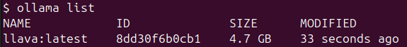
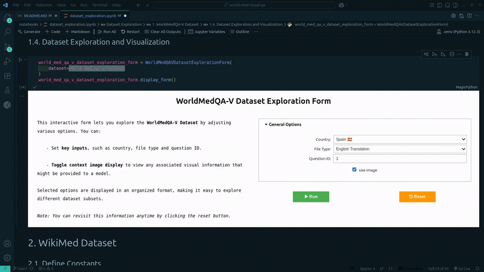
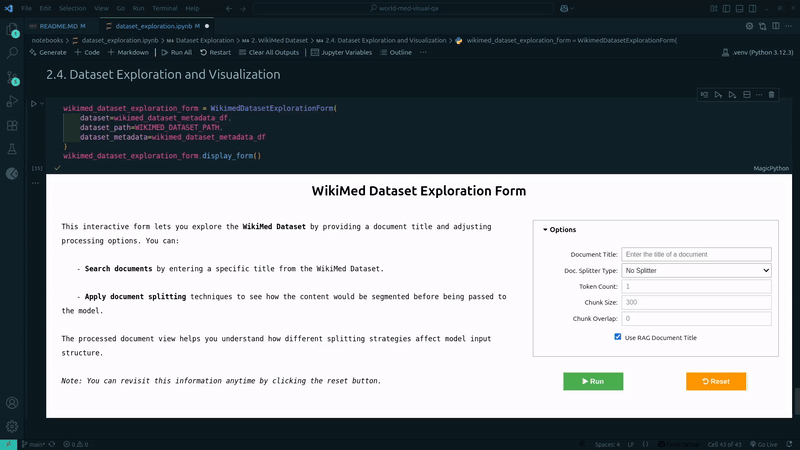
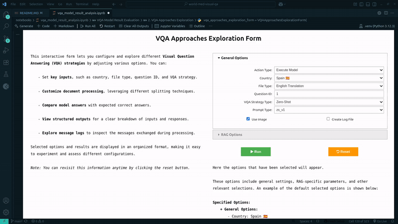

<div align="center">
    <h1 style="margin-bottom: 0;">Enhancing Visual Medical QA with RAG and LLaVA:</h1>
    <p style="font-size: 32px; margin-top: 4px; margin-bottom: 30px"><em>A Case Study on WorldMedQA-V</em></p>
</div>

>This repository contains the source code employed for dataset analysis and model evaluation throughout my **Master's Thesis**.

>It proposes to leverage the **LLaVA** Vision Language Model (VLM) in conjunction with **Retrieval-Augmented Generation (RAG)** to answer **close-ended multimodal-multilingual questions** from the **WorldMedQA-V** dataset. 

---

## 📖 Table of Contents
- [1. 🚀 Motivation](#1--motivation)
- [2. 🛠️ System Design](#2-️-system-design)
- [3. 📂 Repository Structure](#3--repository-structure)
- [4. ⚙️ Installation](#4-️-installation)
- [5. ⏯️ Usage](#5-️-usage)
- [6. 📊 Results](#6--results)
- [7. ✅ Conclusions](#7--conclusions)
- [8. 🚫 Limitations](#8-️-limitations)
- [9. 🔮 Future Work](#9--future-work)
- [10. 📖 Citation](#10--citation)


## 1. 🚀 Motivation
The application of VLMs is quite unusual on medical Visual Question Answering (VQA) tasks and most existing approaches rely on English-only resources. Therefore, this work aims to contribute to this research field by assessing how RAG can enhance a LLaVA model with external medical knowledge, which could serve as a starting point for the development of more universal solutions. 

An in-depth explanation of the approach proposed can be found in the [Master's Thesis Documentation](https://drive.google.com/file/d/15721HNWndR_aQKTT2j0EbApmBcSNzICV/view?usp=sharing).


## 2. 🛠️ System Design


### 2.1. Datasets
| Dataset | Description | Purpose | Link |
|-|-|-|-|
| **WikiMed** | Large-scale medical entity-linking corpus comprising documents extracted from Wikipedia articles. | Retrieval | [Zenodo](https://zenodo.org/records/5755155) |
| **WorldMedQA-V** | Dataset containing multimodal-multilingual close-ended medical question-answer instances. | Evaluation | [Hugging Face](https://huggingface.co/datasets/WorldMedQA/V) |


### 2.2. High-Level Architecture
As it can be observed in the graphical abstract provided below, the RAG pipeline proposed comprises the following core components:

- **LLaVA model**: Acts as the **generator** of the RAG architecture. It is accessed locally via [Ollama](https://ollama.com/) and [LangChain](https://www.langchain.com/).
- **FAISS Index**: Represents the **retriever** element, which is responsible for retrieving relevant documents extracted from *WikiMed*.  
- **WorldMedQA-V dataset**: Serves as the **evaluation benchmark**, including multiple-choice medical questions alongside their associated images, candidate answers and the ground-truth answer. 


### 2.3. Key Design Considerations and Constraints

- [LLaVA](https://ollama.com/library/llava) is set at temperature=0 to enhance reproducibility and constrained to output a single token (A/B/C/D).
- A quantised version of LLaVA is used:
    - 4-bit integer quantisation for the language backbone ([Vicuna](https://huggingface.co/lmsys/vicuna-7b-v1.5)).
    - 16-bit floating point for vision encoder ([CLIP](https://github.com/openai/CLIP)).
- A hybrid between *Naive* and *Advanced RAG* is proposed: 
    - Mainly *Naive RAG* is followed.
    - There is no fine-tuning process involved.
    - Post-retrieval processing from *Advanced RAG* is applied to reduce context length.


### 2.4. Low-Level Architecture

This section provides more specific details of the elements comprising the RAG pipeline:


#### 2.4.1. Visual Question Answering Strategies

Enriches the model's knowledge by varying how the retriever is queried:

- **RAG (Question Only)**: The retriever is queried using only the full question of the original instance. [📑 Example Log](https://github.com/julenfu21/medvqa-rag-llava/blob/main/logs/spain/english/with_image/rag_q/rdc3/rec_char_splitting/tc2_no_title_cs300_co0/spain_english_rq_v6_evaluation/q15.log)
- **RAG (Answers Only)**: Four independent queries are performed, each providing a single candidate answer. [📑 Example Log](https://github.com/julenfu21/medvqa-rag-llava/blob/main/logs/spain/english/with_image/rag_q_as/rdc1/answers_only/rec_char_splitting/tc2_no_title_cs600_co0/spain_english_rq_v5_evaluation/q15.log)
- **RAG (Question and Answers)**: It combines the previous two strategies, therefore querying the retriever five times (one for the question and another four for the candidate answers). [📑 Example Log](https://github.com/julenfu21/medvqa-rag-llava/blob/main/logs/spain/english/with_image/rag_q_as/rdc1/question_and_answers/rec_char_splitting/tc1_no_title_cs300_co0/spain_english_rq_v5_evaluation/q15.log)


#### 2.4.2. Post-Retrieval Processing 

Reduces context length and avoids having excessively long contexts:

- **Paragraph Splitter**: Returns the first N paragraphs of a document.
- **Recursive Character Splitter**: Returns the first N chunks split in a recursive fashion, leveraging the [implementation provided by LangChain](https://python.langchain.com/api_reference/text_splitters/character/langchain_text_splitters.character.RecursiveCharacterTextSplitter.html#langchain_text_splitters.character.RecursiveCharacterTextSplitter.split_text).
- **spaCy Sentence Splitter**: Returns the first N sentences employing the [en_core_web_sm spaCy pipeline](https://spacy.io/models/en#en_core_web_sm). 

#### 2.4.3. Base Prompt Design Elements 

Defines the final prompt structure given to the model, inspired by [Pinecone](https://www.pinecone.io/learn/series/langchain/langchain-prompt-templates/):

- **Instructions**: Instructs on how to handle the original query and the external context.
- **External Information**: Constitutes the context retrieved from the external knowledge base.
- **User Input**: The query provided by the user, containing a question, a medical image in base-64 format and the candidate answers.


## 3. 📂 Repository Structure

Next, a shortened overview of the project is shown, highlighting the purpose of the main files and folders:

```
.
├── data/                                   # Datasets for retrieval and evaluation 
│   ├── WikiMed/
│   ├── WorldMedQA-V/           
├── evaluation_results/                     # Model predictions and overall statistics
├── logs/                                   # Log files with configuration parameters, model instructions, conversation history and answer validation 
├── notebooks/                              
│   ├── dataset_exploration.ipynb           # Analysis and exploration of WorldMedQA-V and WikiMed datasets
│   └── vqa_model_result_analysis.ipynb     # Model evaluation, VQA strate> [!NOTE]gies exploration and result analysis
├── scripts                                  
│   ├── utils/                              
│   ├── evaluate_vqa_model.py               # Model evaluation
│   ├── explore_wikimed_dataset.py          # Wikimed dataset exploration
│   └── explore_world_med_qa_v_dataset.py   # WorldMedQA-V dataset exploration
├── src/
│   ├── ui/                                 # Classes for interactive forms used in notebooks
│   ├── utils/
│   │   ├── dataset_helpers/                # Helper functions to plot and fetch data
│   │   ├── prompts/                        # Custom prompts for VQA strategies
│   │   └── text_splitters/                 # Classes to split text for post-retrieval processing
│   ├── visual_qa_strategies/               # Implementation of all VQA strategies
│   └── visual_qa_model.py                  # Main model integration
├── .gitignore
├── README.MD
└── requirements.txt
```


## 4. ⚙️ Installation


### 4.1. Clone the Repository:

```shell
git clone https://github.com/julenfu21/medvqa-rag-llava.git
cd medvqa-rag-llava
```

### 4.2. Create and activate a Virtual Environment

```
python3 -m venv .venv
```

- On macOS / Linux:

    ```shell
    source .venv/bin/activate
    ```

- On Windows:
    ```shell
    .venv\Scripts\activate
    ```


### 4.3. Install Dependencies

```shell
pip install -r requirements.txt
```


### 4.4. Install Ollama and Download the LLaVA Model.

1. Install Ollama:

```shell
curl -fsSL https://ollama.com/install.sh | sh
```

2. Download the LLaVA model:

> 📝 **NOTE**:
> The LLaVA model is several GB in size. Make sure you have sufficient disk space and a stable internet connection.

```shell
ollama pull llava
```

3. Verify installation and confirm the model is available: 

```shell
ollama list
```




4. (Optional) Test that the model runs correctly:

> 📝 **NOTE**:
> You can press `Ctrl+D` to stop the interactive session.

```shell
ollama run llava
```


### 4.5. Download the Datasets

> 📝 **NOTE**:
> Total download size is ~5.5 GB. This may take a while depending on your internet connection. The datasets will be stored in `./data/`.

```
gdown --folder https://drive.google.com/drive/folders/1qIhnPssIp5_kPQg1A0Af_w_FjiMFcrIL -O data
```


## 5. ⏯️ Usage


### 5.1. Datasets Exploration

You can explore the datasets in two ways:

- **Via scripts**:

    > 💡 **TIP**:
    > The commands below are just examples. You can check all the parameters available using the `-h` flag.


    - **WorldMedQA-V** dataset:

        ```shell
        PYTHONPATH=$(pwd) python scripts/explore_world_med_qa_v_dataset.py \
            --question_id=15 \
            --country=spain \
            --file_type=english \
        ```

    - **WikiMed** dataset:

        ```shell
        PYTHONPATH=$(pwd) python scripts/explore_wikimed_dataset.py \
            --document_title=Polypterus \
            --doc_splitter=recursive_character_splitter \
            --token_count=2 \
            --chunk_count=600
        ```

- **Via notebooks:**  

    > 📝 **NOTE**:
    > Open the [`notebooks/dataset_exploration.ipynb`](notebooks/dataset_exploration.ipynb) file and move to the section containing the dataset desired to be explored.

    - **WorldMedQA-V** dataset:
    
        

    - **WikiMed** dataset:

        


### 5.2. Model Evaluation

- **Via Scripts:**

    > 💡 **TIP**:
    > The commands below are just examples. You can check all the parameters available using the `-h` flag.

    - Best configuration for **Zero-Shot**:

        ```shell
        PYTHONPATH=$(pwd) python scripts/evaluate_vqa_model.py \
            --country=spain \
            --file_type=english \
            --vqa_strategy=zero_shot \
            --prompt_type=zs_v2 
        ```

    - Best configuration for **RAG (Question Only)**:

        ```shell
        PYTHONPATH=$(pwd) python scripts/evaluate_vqa_model.py \
            --country=spain \
            --file_type=english \
            --vqa_strategy=rag_q \
            --prompt_type=rq_v6 \
            --relevant_docs_count=3 \
            --doc_splitter=recursive_character_splitter \
            --token_count=2 \
            --chunk_size=300
        ```

    - Best configuration for **RAG (Answers Only)**:

        ```shell
        PYTHONPATH=$(pwd) python scripts/evaluate_vqa_model.py \
            --country=spain \
            --file_type=english \
            --vqa_strategy=rag_q_as \
            --prompt_type=rq_v5 \
            --relevant_docs_count=1 \
            --doc_splitter=recursive_character_splitter \
            --token_count=2 \
            --chunk_size=600
        ```

    - Best configuration for **RAG (Question and Answers)**:

        ```shell
        PYTHONPATH=$(pwd) python scripts/evaluate_vqa_model.py \
            --country=spain \
            --file_type=english \
            --vqa_strategy=rag_q_as \
            --prompt_type=rq_v5 \
            --relevant_docs_count=1 \
            --doc_splitter=recursive_character_splitter \
            --token_count=1 \
            --chunk_size=300 \
            --should_apply_rag_to_question
        ```


- **Via notebooks**:

    Open the [`notebooks/vqa_model_result_analysis.ipynb`](notebooks/vqa_model_result_analysis.ipynb) file and move to:
    
    - ... section **1. Evaluation of VQA Approaches** for Python code examples.

    - ... section **2. VQA Approaches Exploration** for interactive execution of experiments:

        

        > 💡 **TIP**:
        > In case thers is an attempt to fetch evaluation results from settings in which the model has not been evaluated yet, code to perform such evaluation is provided.
        
         


## 6. 📊 Results


This section provides a brief overview of results. For a detailed analysis, refer to section **4. Findings** in the [Master's Thesis Documentation](https://drive.google.com/file/d/15721HNWndR_aQKTT2j0EbApmBcSNzICV/view?usp=sharing).


### 6.1. Development Subset (Spain-English)

| VQA Strategy | Prompt Type | Relevant Document Count | Title | Chunk Count | Chunk Size | Accuracy
|-|:-:|:-:|:-:|:-:|:-:|:-:|
| [Matos et al. (2024)](https://arxiv.org/abs/2410.12722) | - | - | - | - | - | **0.4500** |
| Zero-Shot | [`zs_v2`](src/utils/prompts/zero_shot_prompts.py#L57-L102) | - | - | - | - | 0.3040 |
| RAG (Question Only) | [`rq_v6`](src/utils/prompts/rag_q_prompts.py#L314-L380) | 3 | No | 2 | 300 | 0.3120 |
| RAG (Answers Only) | [`rq_v5`](src/utils/prompts/rag_q_prompts.py#L250-L311) | 1 | No | 2 | 600 | <u>0.3200</u> |
| RAG (Question and Answers) | [`rq_v5`](src/utils/prompts/rag_q_prompts.py#L250-L311) | 1 | No | 1 | 300 | <u>0.3200</u> |

All RAG implementations slightly outperform the *Zero-Shot* baseline, indicating a modest performance gain. However, *Matos et al. (2024)* clearly outperforms the approaches implemented in this work, suggesting there is ample room for improvement.


### 6.2. Test Subset

| | Zero-Shot | RAG (Question Only) | RAG (Answers Only) | RAG (Question and Answers) |
|-|:-:|:-:|:-:|:-:|
| Brazil | <u>0.3371</u> | <u>0.3371</u> | **0.3483** | 0.2809 |
| Israel | 0.2324 | 0.2378 | **0.2541** | <u>0.2486</u> |
| Japan | 0.2738 | 0.2798 | <u>0.3452</u> | **0.3929** |
| **Mean Accuracy** | 0.2811 | 0.2849 | **0.3159** | <u>0.3075</u> |

The RAG implementations generally outperform the *Zero-Shot* variant, showcasing enhanced generalisation capabilities for other English-translated subsets. Moreover, according to the mean accuracy, the best performing VQA strategies are *RAG (Answers Only)* and *RAG (Question and Answers)*.

<br>


| | Zero-Shot | RAG (Question Only) | RAG (Answers Only) | RAG (Question and Answers) |
|-|:-:|:-:|:-:|:-:|
| Spain | **0.2800** | <u>0.2560</u> | 0.2480 | <u>0.2560</u> |
| Brazil | <u>0.2809</u> | **0.3034** | <u>0.2809</u> | <u>0.2809</u> |
| Israel | 0.2270 | 0.2324 | <u>0.2378</u> | **0.2541** |
| Japan | 0.2083 | **0.2619** | **0.2619** | <u>0.2440</u> |
| **Mean Accuracy** | 0.2491 | **0.2634** | 0.2572 | <u>0.2588</u> |

Except for the Spain subset, RAG approaches improve *Zero-Shot* results on local language splits. Overall, *RAG (Question Only)* is the best performing approach, followed closely by *RAG (Question and Answers)* and showing a small improvement from *Zero-Shot*.


### 6.3. Best Configurations on All subsets without Context-Image

| | Zero-Shot | RAG (Question Only) | RAG (Answers Only) | RAG (Question and Answers) |
|-|:-:|:-:|:-:|:-:|
| Spain | 0.2880 | **0.3120** | <u>0.3040</u> | 0.2880 |
| Brazil | 0.3146 | 0.3258 | **0.3708** | <u>0.3483</u> |
| Israel | 0.2270 | 0.2324 | **0.2541** | <u>0.2432</u> |
| Japan | 0.2738 | 0.2917 | <u>0.3690</u> | **0.3810** |
| **Mean Accuracy** | 0.2759 | 0.2905 | **0.3245** | <u>0.3151</u> |

RAG approaches generally improve over *Zero-Shot* variant, with a significant improvement on both *Japan* and *Brazil* English-translated splits. In addition, the best approaches are *RAG (Answers Only)* and *RAG (Question and Answers)*, being consistent with the first table of test results despite the absence of visual information.

<br>


| | Zero-Shot | RAG (Question Only) | RAG (Answers Only) | RAG (Question and Answers) |
|-|:-:|:-:|:-:|:-:|
| Spain | 0.2720 | <u>0.2880</u> | 0.2560 | **0.2960** |
| Brazil | 0.2921 | **0.3258** | 0.3034 | <u>0.3146</u> |
| Israel | 0.2270 | **0.2378** | <u>0.2324</u> | **0.2378** |
| Japan | 0.2083 | 0.2262 | <u>0.2500</u> | **0.2798** |
| **Mean Accuracy** | 0.2499 | <u>0.2695</u> | 0.2605 | **0.2821** |

Once again RAG approaches improve *Zero-Shot* baseline. The best approaches are *RAG (Question and Answers)* and *RAG (Question Only)*, reversing their order in comparison with the second table of test results. As in the previous table, the performance gain against *Zero-Shot* is more noticeable.


## 7. ✅ Conclusions

Upon completion of this work, the following conclusions can be drawn:

- Applying RAG enhances model's capabilities, providing more factually grounded and accurate answers.
- The LLaVA model acquires cross-language generalisation capabilities when combined with RAG, despite the retrieval dataset contains English-only documents.
- The best performing configuration is generally obtained by combining *RAG (Answers Only)* and *RAG (Question and Answers)* with the *Recursive Character Splitter*.
- Applying RAG has shown to be effective against the absence of visual modality.


## 8. 🚫 Limitations

Results obtained also uncover some limitations that might be addressed in future iterations of this work:

- Different performance across prompt variants is observed, some being substantially sensitive to overly long contexts. An increased sophistication of the prompting design procedure would facilitate its mitigation. 
- It is difficult to compare this work with *Matos et al. (2024)* since experiments are not executed under the same settings. A more closely aligned approach would involve handling longer responses and leveraging a higher order version of the LLaVA model.
- Given the simple-letter responses, it is complicated to trace the model's reasoning process to generate a response. Incorporating Chain-of-Thought could help improve both its explainability and reasoning capabilities.
- Higher performance is obtained with English-translated instances. In order to improve cross-language performance, the retrieval knowledge base could be expanded by adding multilingual domain-specific resources.


## 9. 🔮 Future Work

Based on the conclusions and limitations mentioned, several research directions are proposed:

- [ ] Improve the prompt design procedure enabling more consistent results.
- [ ] Implement additional *RAG IMG* (retrieves relevant images) and *RAG DB-Reranker* (adds re-reranking to post-retrieval stage) VQA strategies (not implemented due to time constraints).
- [ ] Extrapolate the insights acquired to similar datasets (e.g. [VQA-RAG](https://huggingface.co/datasets/flaviagiammarino/vqa-rad), [SLAKE](https://huggingface.co/datasets/BoKelvin/SLAKE), [VQA-Med-2019](https://zenodo.org/records/10499039)) to reaffirm model's generalisation capabilities.
- [ ] Reduce the differences with *Matos et al. (2024)* to carry out a more meaningful comparison.


## 10. 📖 Citation

In case this repository is helpful, you can cite it as follows:

```bibtex
@mastersthesis{julenfuentes2025,
    title={Enhancing Visual Medical QA with RAG and LLaVA: A Case Study on WorldMedQA-V},
    author={Julen Fuentes Aguirre},
    year={2025},
    institution={EHU - Euskal Herriko Unibertsitatea}
}
```